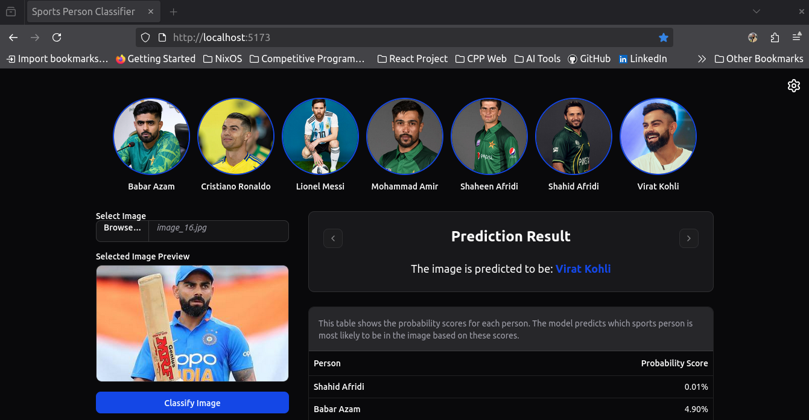
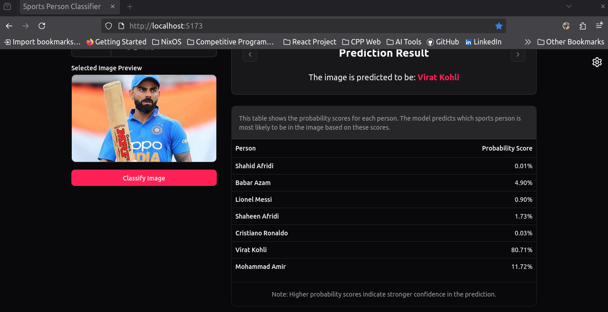
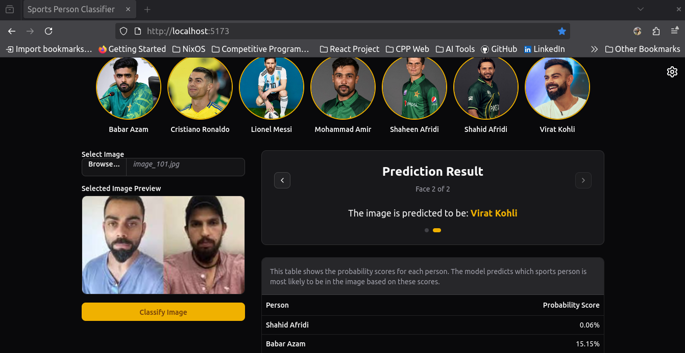
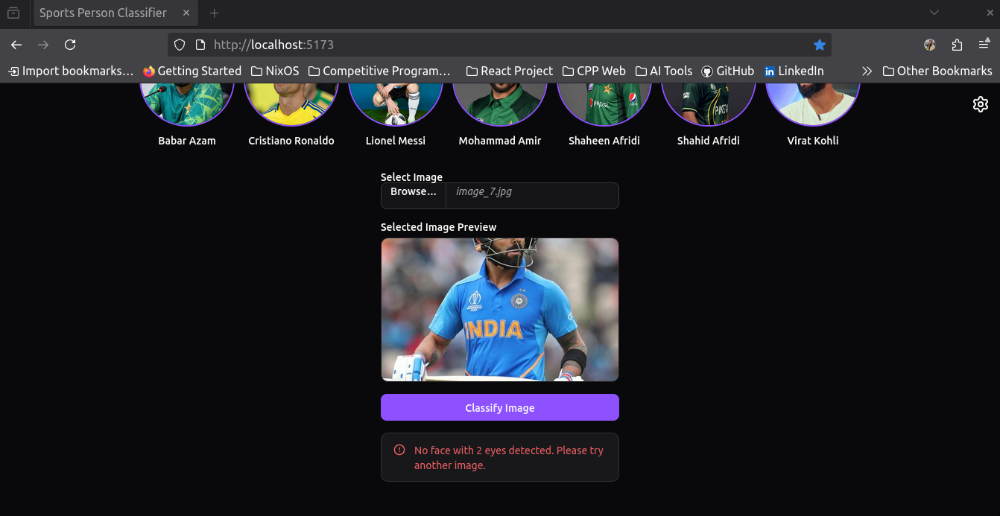
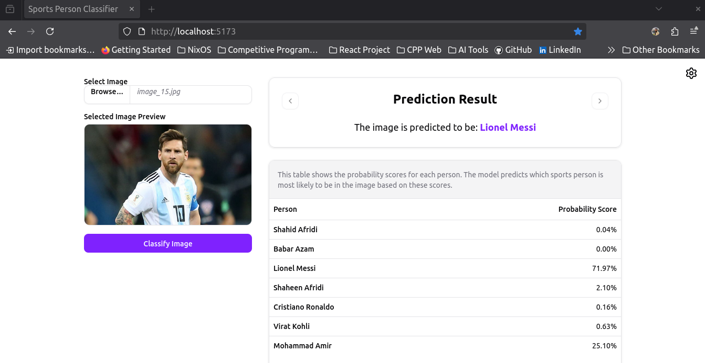

# Sports Person Classifier

This project is a full stack project, containing a frontend, backend and model trained to predict sports person for a few selected persons. The frontend is built using React and the backend is built using Flask Python.

## Demo

### 🎥 Video Demo
https://github.com/nazakatumrani/Sports-Person-Classifier/raw/main/demo/video.mkv

*(Click the link to watch the demo video)*

### 🖼️ Screenshots

  

  

  

  

  

## Dependencies

The model is built using the following Python dependencies, which are listed in the `shell.nix` file:

- python313  
- python313Packages.pandas  
- python313Packages.matplotlib  
- python313Packages.scikit-learn-extra  
- python313Packages.seaborn
- python313Packages.numpy
- python313Packages.opencv4
- python313Packages.pywavelets
- python313Packages.joblib
- python313Packages.flask
- python313Packages.flask-cors

## Frontend

The frontend is built using React (Vite) with ShadcnUI and is located in the `frontend` directory.

## Backend

The backend is built using Flask Python and is located in the `backend` directory.

## Model

The model is trained on sportsman dataset, which is located in the `Model` directory. The model is trained using the `Step 2: w2d transformation and train.py` file.

### Model Directory Details

The `Model` folder contains the dataset of 7 persons (Babar Azam, Cristiano Ronaldo, Lionel Messi, Mohammad Amir, Shaheen Afridi, Shahid Afridi, Virat Kohli), scripts, and artifacts used for training. Here is what each file does:

- **dataset folder** — Contains all 7 peoples images, which are used for training the model. It has a cropped folder which contains the cropped images of the 7 persons.
- **opencv folder** — Contains all haarcascasde xml files including the face and eye detection that are used to find the face and 2 eyes.
- **Step 1: crop_images.py** — It finds the face and 2 eyes in the image and crops it.
- **Step 2: w2d transformation and train.py** — This one performs wavelet transformation on the cropped image and then runs the full training pipeline, including splitting, training, and exporting the model.

## Running the Application

To run the application, navigate to the `frontend` directory and run `npm run dev`. To run the backend, navigate to the `backend` directory and run `python server.py`.